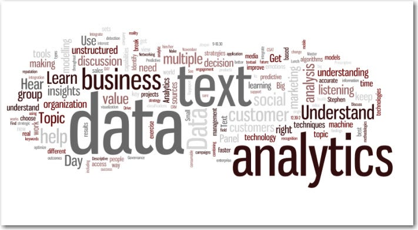

# 📰 Text Analytics & Topic Modeling Project

🚀 A Python NLP project for text preprocessing, TF-IDF analysis, POS tagging, and topic modeling. Explore and visualize insights from your text data with ease!  

This project focuses on **Natural Language Processing (NLP)** techniques to analyze and extract insights from large-scale text data.  
It covers **text preprocessing, TF-IDF computation from scratch, POS tagging using the Viterbi algorithm, and topic modeling using LDA** to uncover hidden structures in news articles.

---

## 📌 Overview

- **Goal**: Analyze textual data to understand word importance, syntactic structure, and latent topics  
- **Techniques Used**:  
  - Text Cleaning & Tokenization  
  - TF-IDF (Implemented from Scratch)  
  - POS Tagging using Viterbi Algorithm  
  - Topic Modeling using LDA  
- **Dataset**: News Articles Dataset (JSON format)  
- **Evaluation**: POS Tagging Accuracy and F1 Score  

---

## 🧠 Problem Statement

With the rapid growth of unstructured text data, it becomes essential to extract meaningful insights automatically.  
This project aims to answer questions such as:  
- Which words are **most informative** in a document?  
- How does **term frequency differ from TF-IDF importance**?  
- Can we **assign grammatical roles** to words using POS tagging?  
- What **hidden topics** exist across a large collection of news articles?  

---

## 🛠️ Technologies Used

- Python 🐍  
- Pandas 🗃️  
- NLTK 📚  
- scikit-learn 💡  
- Matplotlib 📉

---

## ✨ Features

- 🧹 **Text Cleaning & Preprocessing**: Remove noise, special characters, and stopwords  
- 🔤 **Tokenization**: Convert text into tokens for analysis  
- 📊 **TF & TF-IDF Analysis**: Compute term frequency and TF-IDF values  
- 🎨 **Scatter Plot Visualization**: Compare TF vs TF-IDF for random words  
- 🏷️ **POS Tagging**: Part-of-speech tagging using the Viterbi algorithm  
- ✅ **Accuracy & F1 Score**: Evaluate tagging (demo)  
- 🧩 **Topic Modeling (LDA)**: Extract key topics from text  
- 📈 **Topic Word Visualization**: List top words per topic
  
---

## 🛠️ Key Components

### 🧹 Text Preprocessing
- Lowercasing text  
- Removing punctuation, special characters, and digits  
- Stopword removal  
- Tokenization  

### 📊 TF-IDF Analysis
- Manual implementation of:
  - Term Frequency (TF)  
  - Inverse Document Frequency (IDF)  
  - TF-IDF  
- Scatter plot visualization of **TF vs TF-IDF** for randomly selected words  

### 🏷️ POS Tagging
- Creation of POS-labeled data  
- Train-test split of tokenized corpus  
- POS tagging using **Viterbi Algorithm (NLTK)**  
- Performance evaluation using:
  - Accuracy  
  - Weighted F1 Score  

### 🧩 Topic Modeling
- Topic extraction using **Latent Dirichlet Allocation (LDA)**  
- Identification of **10 latent topics**  
- Display of **top 10 words per topic**  

---

## ⚙️ Analysis Highlights

| Task | Outcome |
|----|----|
| Stopword Removal | Cleaned and normalized corpus |
| Bigram Analysis | Most & least frequent word pairs identified |
| TF-IDF | Clear distinction between frequent vs informative terms |
| POS Tagging | High tagging consistency on test data |
| Topic Modeling | Coherent topics extracted from news articles |

---

## 📈 Future Improvements

- 🔹 Implement custom Viterbi algorithm from scratch  
- 🔹 Use word embeddings (Word2Vec / GloVe)  
- 🔹 Improve topic coherence using advanced topic models  
- 🔹 Apply the pipeline to domain-specific corpora  

---

## 📁 Files

- `TextAnalytics.ipynb` – Complete notebook with all sections and outputs  

---

## 📂 Dataset

Due to size constraints, the dataset is **not included** in this repository.

- **Dataset Name**: News Category Dataset  
- **Source**: Kaggle  
- **Link**: https://www.kaggle.com/datasets/rmisra/news-category-dataset

To run the notebook:
1. Download the dataset from Kaggle
2. Place the JSON file in the project directory
3. Update the dataset path in the notebook if required

---

## 🧾 License

This project is intended for **learning and research purposes**.  
Please ensure proper permissions before using datasets for commercial applications.

---

## 🤝 Connect

- [LinkedIn](https://www.linkedin.com/in/varsha-shekhar)
- [Gmail](varshaiyer96@gmail.com)

